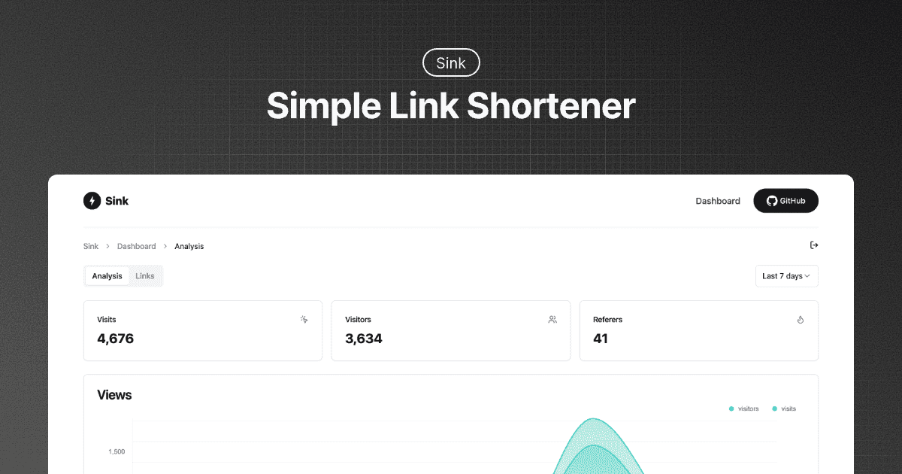
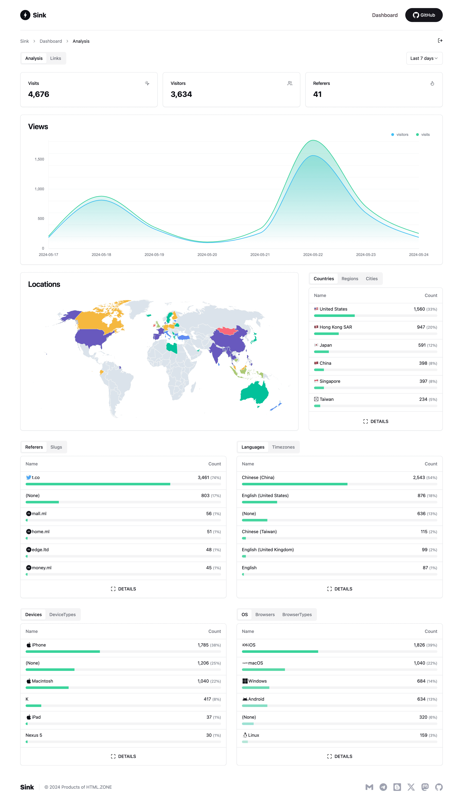
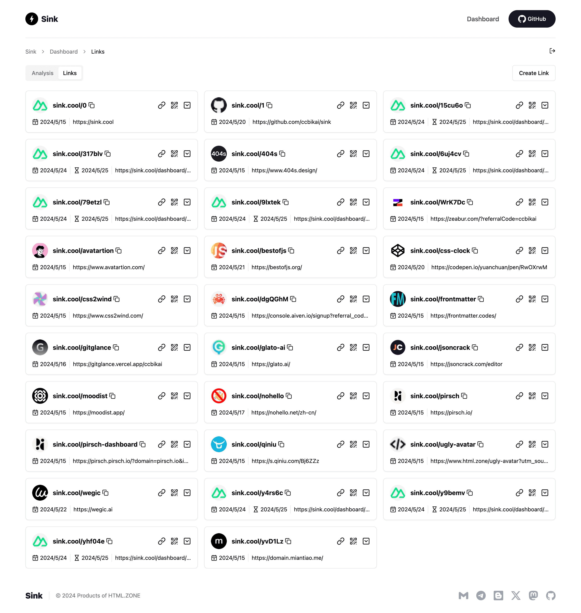
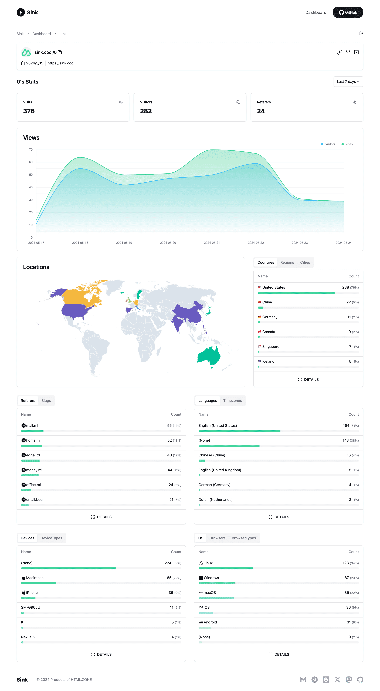

# ⚡ ZQ-URL（中文）

一款完全跑在 Cloudflare 上的短链与数据分析系统。追求简单、快速、稳定，开箱即用。

[](https://github.com/BAYUEQI/ZQ-URL)




---

## ✨ 核心功能

- **短链生成**：把原始链接变成更短的 Slug，方便分享与记忆。
- **访问分析**：查看点击量、来源、地区等核心指标，图表化展示。
- **零服务器维护**：纯 Cloudflare 架构，省心可靠。
- **自定义 Slug**：支持自定义与大小写敏感（可配置）。
- **🪄 AI Slug（可选）**：接入 Workers AI，自动给出更“像人写的”短链。
- **有效期**：支持设置短链过期时间。

## 🪧 演示

在线演示（官方示例）：[`https://sink.cool/dashboard`](https://sink.cool/dashboard)

演示登录 Token：

```txt
SinkCool
```

<details>
  <summary><b>界面截图</b></summary>
  
  
  
</details>

## 🧱 技术堆栈

- **框架**：[Nuxt](https://nuxt.com/)
- **存储**：[Cloudflare Workers KV](https://developers.cloudflare.com/kv/)
- **分析引擎**：[Workers Analytics Engine](https://developers.cloudflare.com/analytics/)
- **UI**：[shadcn-vue](https://www.shadcn-vue.com/)
- **样式**：[Tailwind CSS](https://tailwindcss.com/)
- **部署**：[Cloudflare](https://www.cloudflare.com/)


ZQ-URL 支持两种 Cloudflare 部署形态：

- Cloudflare Workers（推荐，性能更好）
- Cloudflare Pages（静态托管 + 绑定 KV/Analytics/AI）


### 方式一：部署到 Cloudflare Workers（推荐）

1) Fork 本仓库到你的 GitHub 账号。

2) 在 Cloudflare 创建一个 KV 命名空间（控制台：Storage & Databases → KV），把命名空间命名成你喜欢的名字（与绑定名无关），复制其 Namespace ID。

3) 打开根目录 `wrangler.jsonc`，将 `kv_namespaces[0].id` 替换为你自己的 Namespace ID；绑定名已改为 `URL`，无需更改代码。

4) 在 Cloudflare Workers 新建项目，选择此仓库，设置构建与部署命令：

- 构建命令：`pnpm run build` 或 `npm run build`
- 部署命令：`npx wrangler deploy`（或在仓库中使用脚本：`npm run deploy:worker`）

5) 首次部署后，进入项目 → Settings → Variables and Secrets，新增以下环境变量（见下文变量表）：

- `NUXT_SITE_TOKEN`
- `NUXT_CF_ACCOUNT_ID`
- `NUXT_CF_API_TOKEN`

6) 在 Workers & Pages → 右侧 Account details 中找到 **Analytics Engine**，点击 Set up 启用免费配额。`wrangler.jsonc` 已默认将 `ANALYTICS` 绑定到名为 `sink` 的数据集。

7) 兼容标志：在 `wrangler.jsonc` 已启用 `nodejs_compat`，无需额外设置。

8) 重新部署。

9) 后续更新：参考 GitHub 官方文档「同步 fork 的分支」。

文档拓展：[`./docs/deployment/workers.md`](./docs/deployment/workers.md)

### 方式二：部署到 Cloudflare Pages

1) Fork 本仓库到你的 GitHub 账号。

2) 在 Cloudflare Pages 创建项目，选择此仓库，Preset 选择 Nuxt.js。

3) 在 Pages → Settings → Environment Variables 配置：

- `NUXT_SITE_TOKEN`
- `NUXT_CF_ACCOUNT_ID`
- `NUXT_CF_API_TOKEN`

4) 先保存并部署一次后，取消该部署，转到 Settings → Bindings → Add：

- 绑定 **KV Namespace**：变量名 `URL`，选择你创建的 KV 命名空间。
- 绑定 **Workers AI**（可选）：变量名 `AI`。
- 绑定 **Analytics Engine**：启用后绑定变量名 `ANALYTICS` 到数据集 `sink`。

5) Settings → Runtime → Compatibility flags 添加 `nodejs_compat`。

6) 重新部署。


## 🔧 环境变量（必看）

为避免踩坑，建议先把下面三项配置好再部署：

- NUXT_SITE_TOKEN：
  - 作用：后台仪表盘登录口令。
  - 要求：至少 8 个字符，避免使用纯数字。
  - 示例：`ZQURL-Admin-2025`

- NUXT_CF_ACCOUNT_ID：
  - 作用：Cloudflare 账户 ID，调用 Analytics Engine API 需要。
  - 取值：登录 Cloudflare 后在右侧 Account details 可见。

- NUXT_CF_API_TOKEN：
  - 作用：用于访问 Analytics Engine 的 API Token。
  - 权限：至少包含 `Account.Account Analytics`。
  - 建议：为该项目单独创建 Token，便于管理与回收。

常见可选项（按需设置）：

- NUXT_DATASET：
  - 作用：Analytics Engine 的数据集名称。
  - 默认：`sink`（已在 `wrangler.jsonc` 里将 `ANALYTICS` 绑定到该数据集）。
  - 备注：一般不改；改名相当于切换数据库，历史数据不再共用。

- NUXT_HOME_URL：
  - 作用：自定义首页跳转地址（默认显示项目介绍页）。
  - 示例：`https://yourdomain.com`。

- NUXT_CASE_SENSITIVE：
  - 作用：是否让短链区分大小写。
  - 取值：`true` 或 `false`。
  - 默认：`false`（更友好、更不易出错）。

- NUXT_LIST_QUERY_LIMIT：
  - 作用：仪表盘列表的最大查询条数上限。
  - 建议：默认即可；调太大会影响性能。

- NUXT_LINK_CACHE_TTL：
  - 作用：短链跳转结果的缓存时间（秒）。
  - 默认：`60`。

- NUXT_REDIRECT_STATUS_CODE：
  - 作用：跳转时使用的 HTTP 状态码。
  - 可选：`301`（默认）/`302`/`307`/`308`。

- NUXT_REDIRECT_WITH_QUERY：
  - 作用：跳转时是否携带原 URL 的查询参数。
  - 取值：`true` 或 `false`。
  - 默认：`false`。

- NUXT_AI_MODEL / NUXT_AI_PROMPT（可选）：
  - 作用：启用 AI Slug 时指定模型与提示词。
  - 模型列表：见 Workers AI 文档。

- NUXT_PUBLIC_PREVIEW_MODE：
  - 作用：演示模式；短链 5 分钟后过期，且不可编辑/删除。
  - 注意：在 Workers 形态需在 Build 和 Variables and Secrets 两处同时配置。

- NUXT_PUBLIC_SLUG_DEFAULT_LENGTH：
  - 作用：系统自动生成 Slug 的默认长度。
  - 注意：Workers 形态同上，需要双处配置。

- NUXT_API_CORS：
  - 作用：为 API 启用 CORS 支持。
  - 用法：构建时设置 `NUXT_API_CORS=true`。

配置要点：

- Workers：到 项目 → Settings → Variables and Secrets 配置上述变量。
- 以 `NUXT_PUBLIC_` 开头的变量（如预览模式、默认长度）在 Workers 需要在两处配置：
  - Settings → Build → Variables and Secrets
  - Settings → Variables and Secrets

更多可选项与详细解释：[`./docs/configuration.md`](./docs/configuration.md)

## 🧩 Wrangler 与绑定要点

`wrangler.jsonc` 已预置以下关键配置：

- `main`: `dist/server/index.mjs`
- `assets` 静态资源绑定到 `ASSETS`（目录 `dist/public`）
- `compatibility_flags`: `nodejs_compat`
- `kv_namespaces`: 绑定名为 `URL` 的命名空间（请将 `id` 改为你自己的）
- `analytics_engine_datasets`: 绑定 `ANALYTICS` 到数据集 `sink`
- `ai`: 可选绑定 `AI`

预置脚本（`package.json`）：

- `build`: `nuxt build`
- `deploy:worker`: `wrangler deploy`
- `deploy:pages`: `wrangler pages deploy dist`

## 🔌 API（开发者快速上手）

手写 API 文档工作量大，后续会接入 Nitro OpenAPI 自动生成；这里给出最常用的“创建短链”接口，帮助你快速打通端到端。

- 接口地址：`POST /api/link/create`
- 请求头：
  - `authorization`: `Bearer <你的NUXT_SITE_TOKEN>`（示例：`Bearer SinkCool`）
  - `content-type`: `application/json`

示例请求：

```http
POST /api/link/create
HEADER authorization: Bearer SinkCool
HEADER content-type: application/json
BODY  {
  "url": "https://github.com/BAYUEQI/ZQ-URL/issues/14",
  "slug": "issue14"
}
```

响应（201）：

```http
RESPONSE 201
BODY  {
  "link": {
    "id": "xpqhaurv5q",
    "url": "https://github.com/BAYUEQI/ZQ-URL/issues/14",
    "slug": "issue14",
    "createdAt": 1718119809,
    "updatedAt": 1718119809
  }
}
```

字段说明：

- `id`：系统自动生成的唯一标识
- `url`：原始链接，必填
- `slug`：短链标识，可传入或由系统自动生成
- `createdAt`/`updatedAt`：UNIX 时间戳，由系统自动生成

完整 API 文档：[`./docs/api.md`](./docs/api.md)

## 🧰 MCP（可选）

项目未内置原生 MCP Server，但提供 OpenAPI，可配合 `mcp-openapi-proxy` 使用：

> 将 `OPENAPI_SPEC_URL` 的域名替换为你的部署域名；`API_KEY` 与 `NUXT_SITE_TOKEN` 一致。

```json
{
  "mcpServers": {
    "sink": {
      "command": "uvx",
      "args": [
        "mcp-openapi-proxy"
      ],
      "env": {
        "OPENAPI_SPEC_URL": "https://sink.cool/_docs/openapi.json",
        "API_KEY": "SinkCool",
        "TOOL_WHITELIST": "/api/link/create"
      }
    }
  }
}
```

## 🙋 常见问题

详见：[`./docs/faqs.md`](./docs/faqs.md)

要点提示：

- `NUXT_SITE_TOKEN` 不能为纯数字；
- 若统计数据为空，优先检查 `NUXT_CF_ACCOUNT_ID` 与 `NUXT_CF_API_TOKEN`；
- 与 NuxtHub 共用数据集时，需将 `NUXT_DATASET` 指向同一数据集。

## 🗺️ Roadmap（WIP）

- [x] 浏览器插件 - [Sink Tool](https://github.com/zhuzhuyule/sink-extension)
- [x] Raycast 插件 - [Raycast-Sink](https://github.com/foru17/raycast-sink)
- [x] Apple 快捷指令 - [Sink Shortcuts](https://s.search1api.com/sink001)
- [x] iOS App - [Sink](https://apps.apple.com/app/id6745417598)
- [ ] 更强的链接管理（Cloudflare D1）
- [ ] 分析增强（复合筛选）
- [ ] 仪表盘性能优化（无限加载）
- [ ] 单元测试

## 💖 致谢

1. [Cloudflare](https://www.cloudflare.com/)
2. [NuxtHub](https://hub.nuxt.com/)
3. [Astroship](https://astroship.web3templates.com/)

## ☕ 赞助 & 关注

- GitHub Sponsor：[链接](https://github.com/sponsors/ccbikai)
